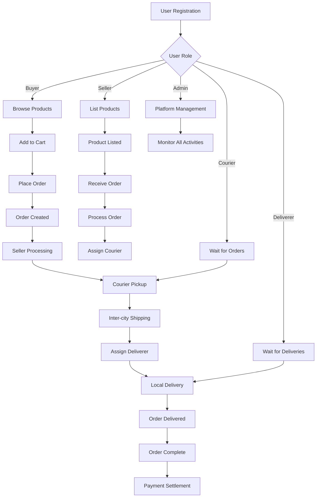

<div align="center">

# BiliBay

[](https://nodejs.org/)
[](https://www.typescriptlang.org/)
[](https://reactjs.org/)
[](https://expressjs.com/)
[](https://pnpm.io/)
[](https://turbo.build/)
[](https://opensource.org/licenses/MIT)

A **Filipino-inspired online marketplace** that connects **buyers**, **sellers**, **couriers**, and **deliverers** in a complete e-commerce ecosystem.
**BiliBay** supports multiple user roles with role-based dashboards, product management, order processing, and a complete delivery workflow from purchase to doorstep delivery.

</div>

---

## About BiliBay

**BiliBay** is a comprehensive online marketplace that connects multiple stakeholders in the e-commerce ecosystem:

- **Buyers**: Browse products, manage cart, place orders, track deliveries
- **Sellers**: List products, manage inventory, process orders, track sales
- **Couriers**: Handle inter-city shipping and logistics
- **Deliverers**: Manage local area deliveries and final handoff
- **Admins**: Oversee platform operations, user management, and analytics

The platform features a complete order fulfillment workflow with role-based access control, real-time order tracking, and integrated payment processing.

## How BiliBay Works



---

## User Roles & Capabilities

### Buyer Features

- **Product Discovery**: Browse and search products by category
- **Shopping Cart**: Add/remove items, manage quantities
- **Order Management**: Place orders, track status, view history
- **Payment Options**: Cash on Delivery (COD) or Bank Transfer
- **Profile Management**: Update personal information and addresses

### Seller Features

- **Product Management**: Create, edit, and manage product listings
- **Inventory Control**: Track stock levels and product variants
- **Order Processing**: View and process incoming orders
- **Sales Analytics**: Monitor sales performance and metrics
- **Courier Assignment**: Assign orders to courier services

### Courier Features

- **Order Assignment**: Receive orders for inter-city shipping
- **Logistics Management**: Handle shipping and tracking
- **Deliverer Coordination**: Assign orders to local deliverers
- **Status Updates**: Update shipping status and tracking info

### Deliverer Features

- **Local Delivery**: Handle final mile delivery in local areas
- **Proof of Delivery**: Upload delivery evidence and photos
- **Route Optimization**: Manage delivery schedules efficiently
- **Customer Interaction**: Direct communication with buyers

### Admin Features

- **User Management**: Oversee all user accounts and roles
- **Platform Analytics**: Monitor system performance and metrics
- **Order Oversight**: Manage and resolve order issues
- **Category Management**: Organize product categories
- **Payment Monitoring**: Track payment transactions and status

---

## Getting Started

Ready to explore BiliBay? Check out our [Contributing Guide](CONTRIBUTING.md) for detailed setup instructions, development workflow, and technical documentation.

### Quick Start

```bash
# Install dependencies
pnpm install

# Start development servers
pnpm dev
```

- **Frontend:** [http://localhost:5173](http://localhost:5000)
- **Backend:** [http://localhost:4000](http://localhost:4000)

---

## License

MIT License © 2025 marcuwynu23
